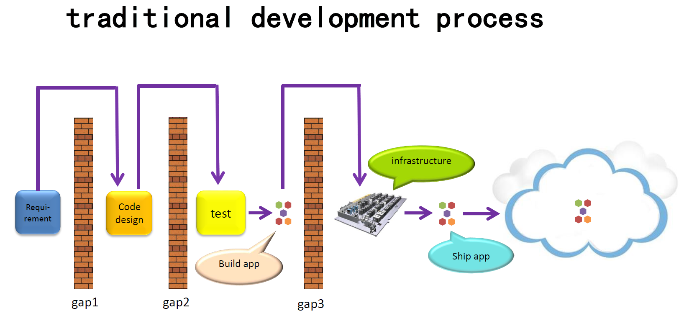
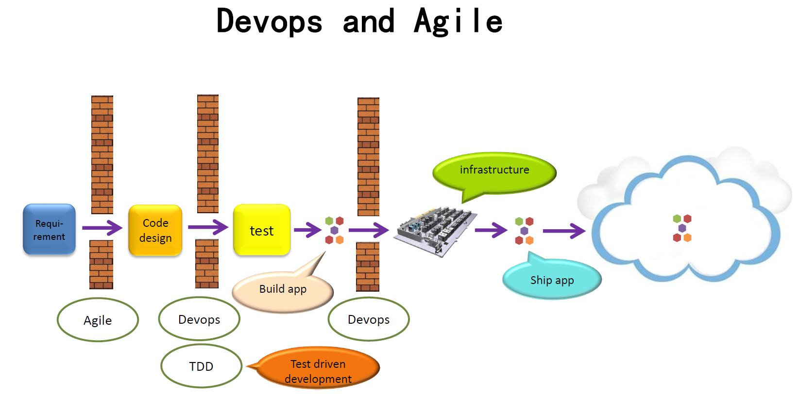
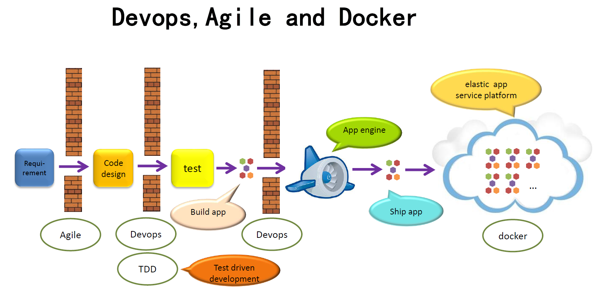
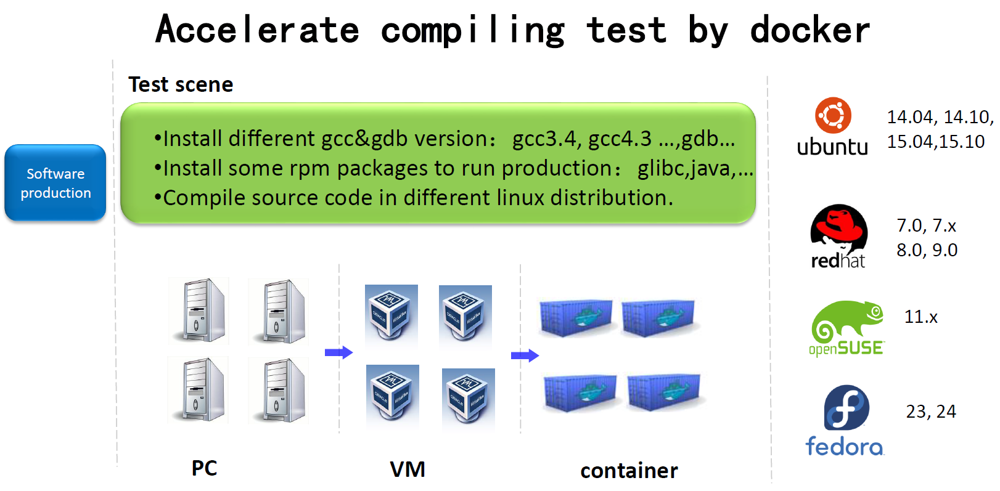
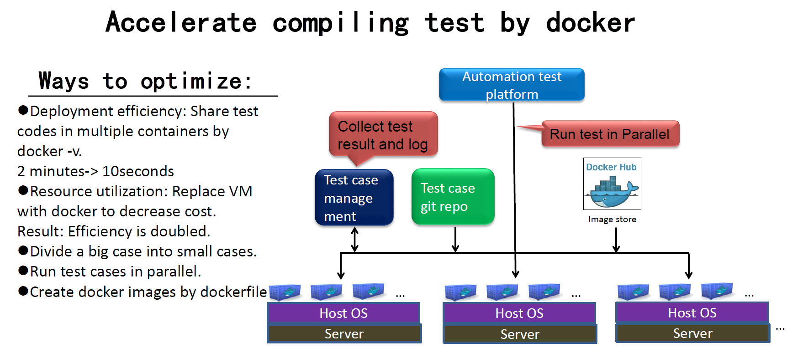
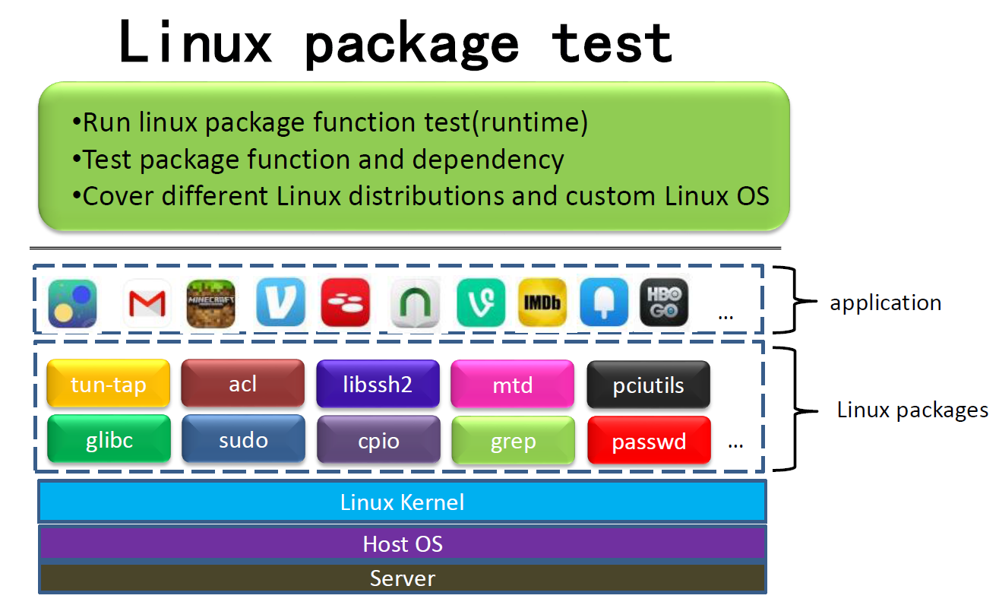
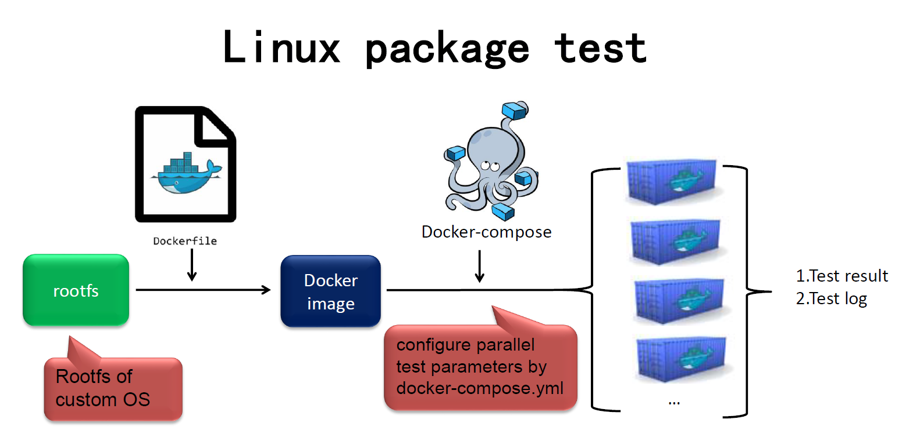

# Docker leads software test innovation
While Docker is accepted by more and more people, it is applied `more and more` widely. This paper would introduce the effect of Docker on software testing technology from testing type, Devops, test automation, test scenarios, test practice and so on. I assume that readers have known Docker and its dependency on core technology of kernel. If you don't know much of it, read [docker document](https://docs.docker.com/) in advance.

## 1.Pain points of traditional software development progress
In traditional software development progress before Devops, developers do code and self-test at first. Then the codes will be pushed into git repository. Developers will build software code to create binary files before each test iteration. Tester will test and verify this iteration. After the verification is pass, it is released to operation team. Operators would deploy the release in servers for customers.

In this process, pain points are as follow:

(1)Different environment among development, test, operation teams

In this situation, some bugs, which should have been found in development phase, can't be found till test phase or operation phase. Sometimes software works fine in development environment. However, it is down once it is deployed in operation phase. At this time, the operation team had to resort to development team, leading to a decline in the efficiency of the entire team.

(2)Can't accurately obtain the software environment of customers.
 
We often can't reproduce the defects customers submit and have to debug on customers' site.

(3) Developers don't tend to execute enough test cases before codes are pushed.

The self test task is dependent on developers' responsibility. Because there is no process to ensure that the self test task is complete. This leads to the fact that some low level software defects are left to test team and operation team.

(4)Developers fail to reproduce the defects testers submit, which leads to buckpassing between the two teams.

(5)Have to spend too much time in setting up test environment; The cost of automation test is high.

We often use VM to set up traditional engineering environment. VM's resource consumption is high and its development speed is slow. Automation efficiency is not high.

## 2. Current challenges in test technology domain
The above pain points make test technology face some challenges. They include, but are not limited to the following. 
(1)set up consistent test environment 
(2)deploy software quickly 
(3)Execute test in parallel and ensure that test environment isn't contaminated. 
(4)Reproduce software defects successfully. 
(5)Create clean test environment. 
(6)Set up test tools correctly. Need to set up a tool in different linux distributions. 
(7)Deploy some test hosts quickly. 
(8)Import test data quickly. 
(9)Clean up test environment quickly. 
(10)Save, copy, and restore test environment quickly. 

## 3.The revolutionary influence of Docker on test technology
These challenges used to be a bottleneck restricting efficiency enhancement. With the birth of Docker, some difficult challenges can be  smoothly solved. We can effectively support test tasks by use tools of Docker ecology. They are shown as follow.

(1)Find software defects in unit test phase as early as possible.

Test driven development is a milestone in innovation. It means that a developer needs to push not only development codes but also corresponding testing codes at the same time. The system would trigger a round of automation test after the push. Test environment can be deployed by Docker, which supports automation test task and ensure that defects of unit test can be found at the first time.

(2)To provide clean test environment for function test and integration test.

For saving cost, different kinds of test tasks have to be executed in one VM in many companies. The execution of the test tasks often pollute test environment. Now it can be solved by isolation  of Docker.

(3)Testers or customers don't have to set up environment according to lengthy configuration document.

Testers often run tests with a lengthy document provided by developers. However, some steps often be skipped in the documents. It is difficult for testers to set up test environment at once. Now testers can simplify the task of setting up environment by docker images and don't have to read the lengthy documents. It is easy to set up test environment by docker images provided by developers.

(4) It is easy to reproduce defects submitted by customers.

When a customer find a defect, software environment can be packaged by docker images to provide it for developers. Developers can obtain the software environment which is consistent with the customer.

(5)To deal with the steps of test images creation by Dockerfile.

If some of the steps need to be adjusted(for example, install gcc4.3 instead of gcc3.4), a new docker image can be recreated after Dockerfile is modified. You don't have to reconfigure the environment manually.

(6)To share test suites and test tools by docker images.

In this way software can run in different linux distributions. Software providers can focus on the functions of the software without spending too much time in adjusting the software to different linux distributions.

(7)Use the tools of Docker ecosystem to quickly create a scalable test environment,  greatly reducing time spent. 

A test task can be complete for a short time by using thousands of containers. These container resources can be released quickly, increasing the efficiency of the resource usage.

(8)Superior performance parameters

Test efficiency can be increased by Docker better performance than VM. Map the directory of the host to that of the container by docker "-v" option, which quickly shares test files. No sooner test tasks are complete than containers be stopped and removed, and system resource is released by Docker “--rm” option.

(9) It is easy to restore environment(including memory)-CRIU technology(Checkpoint Restore In Userspace)

Docker with CRIU can save the running state of a container. CRIU is the basis of live migration of container.

## 4.Devops and Docker
The word “Devops” comes from the combination of “Development” and “Operations”. It focuses on the communication and cooperation between developers and operators. Devops uses automation processes to ensure that software build, test, the release is more quick, frequent, reliable.

In pre-Devops time, operators deployed a release version in infrastructure of a company after the release was developed and tested. However, developers, testers, operators lack effective cooperative mechanism, resulting in low cooperation efficiency. Developers often focus on the development of new functions and quick iterations, but operators focus on stability of software and don’t hope frequent iterations. They often argue with each other.

In Devops time, the team breaks up the barriers among developers, testers, operators by cooperation and automation. Once new codes are pushed, the system would trigger automation test in development environment, test environment, operation environment to ensure that defects are found as early as possible. However, when a business peak occurs, VM of traditional infrastructure can’t deal with.

Post-devops time means that Devops and Docker work together. In the time, Docker is used to shield the difference among multiple platforms and Docker image is considered as a delivery  standard. The business software is running in Docker containers of development, test, operation environment, ensuring applications and their dependency of 3 environments are consistent. With the popularity of cloud, the application engine is available in many cloud platforms. If your application conforms to the specification of the engine, the cloud platform can monitor the load of business automatically. The platform use rapid deployment, rapid expansion of resources, and other features to deal with business peak, effectively support business.

## 5.Docker and automation testing
We can replace repetitive boring manual test tasks with automation test scripts. The cost of automation is the preparation and maintenance of automation codes. The benefit from automation is time saving of test execution. In short, if the benefit is greater than the cost, it is worth automating. Or only benefit is the improvement of the automation test skill of testers. The cost of automation is greatly decreased by rapid deployment, sharing of environment and other features of Docker. Many test tasks, which used to be not worth automating, have been worth automating. The efficiency of project is greatly enhanced.

Is it necessary to improve automation tests if they run in VMs? Answer depends on a case by case basis. I don’t agree that all test tasks should be improved by Docker. If VM has meet test requirements, you need to evaluate the cost of the improvement by docker. Time spent in studying Docker is considered as one of the cost. Whereas: if VM can’t meet the requirements, you can improve test tasks by Docker as soon as possible.

## 6.Limitation of Docker
Build, Ship, and Run Any App, Anywhere. The sentence is a propaganda published by Docker authority. However, due to the characters of Docker itself, its usage scenarios have some limits.

(1)Host and container share kernel. If a container need different kernel version, kernel of host have to be changed. If the kernel of the host is updated, other containers are impacted. The way to work around it to decouple application codes from kernel features.

(2)Kernel version is at least 3.10 for Docker. If you want to use advanced features of Docker, such as user namespace, a higher kernel version is needed.

(3)Kernel modules can be loaded or unload in a container if the container is started with the "--privileged" option. But the operation will impact on the host and other containers.

(4)Can't mock the running environment of different archs. For example, a container of arm64 arch can't be started in a x86 platform.

(5)Docker use namespace feature to isolate containers. The namespace is a soft isolation technology and its security is low.

(6)Because time namespace feature is accepted in kernel mainline, the time modification of the container has impacted on that of the host.

## 7. Which scenario is applicable to Docker?
Because the host and the container share kernel, for task tasks not strongly correlated with kernel, it is applicable to improve them by Docker. For example, source code compiling test, software installation test, web application test, database test etc. Test task strongly correlated with kernel can't be improved by Docker, such as network module test of kernel, kernel namespace test etc.

## 8.Docker test practices
### 8.1.code compiling test

We used to install linux distributions and execute tests in multiple physical computers. We have to reset test environment manually when all of test tasks need be reran. Then we replace physical computers with VMs. Although VM environment can be reset automatically, resource consumption of VM is high and the efficiency is low.

Then we create docker images based on test environment and improve test methods.

(1)Map the directory of the host to that of the container by docker "-v" option, which shares test codes in multiple containers. Time spent is decreased from 2 minutes to 10 seconds.

(2)Divide a big case, whose execution time is long, into some small cases.

(3)Make use of containers to run test cases in parallel.

(4)Use Dockerfile to deal with the installation of dependency packages and compiling software.

Compiling test is in user mode and can be accelerated by Docker. For a test task in a linux distribution, we can start thousands of containers for a short time to accelerate test execution.

### 8.2.linux package test

Linux packages include dynamic link libraries linux common command tools, which belong  middle layer of linux OS. Applications run in the above layer and it is supported by linux kernel below. We used to run package tests in serial and efficiency is low. Because of test environment contamination, it is easy to produce wrong reports of software defects. For improving it, we create a docker image by  Dockerfile based on rootfs and execute test cases in parallel.

There is comparison between before and after improvements.

| Test in VM:                                       | Test in containers:                                       |
| ---------------------------------------- | ---------------------------------------- |
|Only one test environment in one VM. The utilization of the host is not high. |Multiple test environments in one VM. The host resources can be used efficiently, which save too much cost especially when the price of the host is high.|
|Run tests in serial. It is not easy to run tests in parallel because of test environment of pollution.|Run tests in parallel by Using Docker to isolate test tasks, which increase cpu utilization. |
|The cleanup of test environment is dependent on a programmer’s skill. In each test case, there is a cleanup function, which is for resource and environment recovery. If a program's skill is not high, not all resource can be recovered and test environment is contaminated. |The cleanup of test environment is done by the docker container. Containers can be removed automatically after tasks are complete. Even if there is no cleanup function, resource can also be recovered.|
|The cleanup of test environment is done by a docker container. When some cases are executed in sequence, parts of them are failed. However, the test is pass, only when it is executed separately. Test environment often lead to the problem. |Docker provides clean test environment for each package test.|
|Different compiling environment between developers and testers leads to different test result. |Create the same compiling environment by docker image or dockerfile. |
|Network package test(server and client) needs two VMs.|Two containers(server and client) in one VM can deal with network package test.|

## 9.How does Docker accelerate test execution?
Docker can't accelerate test execution by itself. A test case is executed in a container with approximately 5% of performance penalty. However, we can make use of quick deployment, environment sharing and other features of Docker and test resource in container cloud to deal with business peak. If deployment time is ignored, when  each test case is infinitely small and test resources are infinitely enough, the time required for test execution is infinitely little.

## 10.Summary
Some test tasks can be improved by Docker. Readers can use Docker to improve test project capability according to local conditions.

## Authors
Yuan Sun, Senior Software Engineer, Central Software Institute, HUAWEI. He has more than 9 years experience in software testing. He led container testing team to complete test tasks of container components for HUAWEI public cloud and supported other teams to accelerate test execution with Docker. He concentrated on function, performance, security, reliability and stress tests for Docker technology. He is a speaker on Docker meetup, China test conference, China Open Source Conference. He has contributed some test cases for Docker and ltp open source community. Previously, he was test leader in Wind River.

