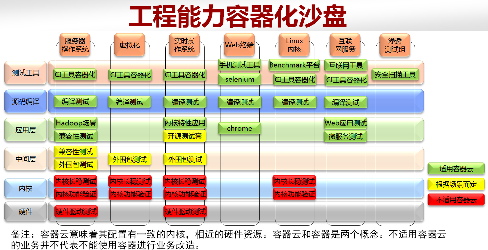
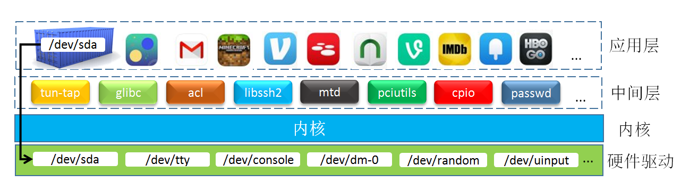

# 测试工程能力容器化改造方案
随着容器时代的到来，开源社区中诞生了以Docker、Rkt为代表的优秀的容器引擎方案。本文旨在介绍通过容器技术对不同测试类型（应用层测试、中间层测试、内核测试、硬件驱动测试、编译测试）进行容器化改造的方案和收益，并通过具体实例的方式来展示容器化时代为软件测试带来的机遇。

## 1.测试工程能力容器化技术沙盘
容器时代为云产业带来了前所未有的机遇，容器云平台如雨后春笋般的出现在大家的视野中。大部分容器云都提供了代码托管、镜像存储、编译、测试、打包、运维等功能。容器云中的容器通常配置有一致的内核，相近的硬件资源。很多的软件测试任务可以通过容器云进行改进或加速。然而，还有一些类型的测试任务不适用容器云。需要说明的是容器云和容器是两个概念。不适用容器云的业务并不代表不能使用容器对软件测试业务进行改造。

以下沙盘覆盖服务器操作系统、虚拟化、实时操作系统、手机应用、linux内核、互联网应用、渗透测试业务，同时对各业务以测试工具、源码编译、应用层、中间层、内核、硬件为基准进行分层。绿色表示该业务适用容器云；黄色表示需要根据具体场景来确定是否适用于容器云；红色表示该业务不适用容器云。我们将在接下来的章节中讨论各业务的容器化改造方案。

## 2.各测试类型容器化方案
以下列举了分层中的典型业务的容器化改造方案，某些方案可以在不同的业务中拉通。读者可以根据自己的实际场景有针对性的规划适合自身业务的容器化改造方案。
### 2.1.测试工具容器化

魏妍负责

### 2.2.源码编译测试容器化
源码编译测试是运行在用户态中的程序，属于CPU密集型的测试任务。其执行测试所需时间与系统资源成反比。容器云是以时间和资源使用量为基准收费的。可以通过Docker快速部署、快速伸缩的特点，在短时间内获取容器云中大量系统资源支撑测试执行已达到加速测试的目的。在测试执行完之后，可快速释放所占资源，减少测试成本。同时可以在Dockerfile中梳理编译依赖包（如gcc）和编译软件的安装，使得环境准备的步骤更加清晰。
### 2.3.应用层软件测试容器化

魏妍负责

### 2.4.中间层软件测试容器化
Linux外围包（通常是rpm或deb包）是操作系统的中间层，绝大部分外围包与内核无强依赖，是适合使用容器云进行加速的。因为在容器云中无法自定义内核，所以与内核相关性强的外围包是不适合使用容器云加速的。对于这类测试，读者可以搭建可定制内核的私有云来实现与内核有强相关的外围包测试执行加速。

除此之外，还有两个特例需要说明一下。

(1)grub包:grub是多启动规范的实现，它允许用户可以在计算机内同时拥有多个操作系统，并在计算机启动时选择希望运行的操作系统。因为与主机启动强相关，所以不适用容器加速。

(2)ntp包:ntp是网络时间协议(Network Time Protocol)，它是用来同步网络中各个计算机的时间的协议。因为当前内核不支持time namespace，即容器与主机间、容器与容器间不能使用不同的时间（注意是时间不时时区）。而更改容器时间就不得不更改主机时间，使得无法构建具有不同时间的测试环境。如果使用不同主机中的容器来规避该问题，虽然可以构建对应的测试环境，但又无法有效利用容器快速部署、执行带来的收益，相当于为了使用容器而使用容器，没有实际意义。
### 2.5.内核测试容器化
Ltp测试套中包含了最全面的内核功能测试用例集。该测试套的调度程序是串行执行测试用例的。可以通过如下几个方面对内核测试进行容器化改造。
(1)启动多个容器并发执行内核功能测试来提高cpu负载，以便减少测试执行时间。然而，内核测试的容器化会有一定的局限性。这主要体现在： 
    A.在容器内执行内核测试时会有部分用例执行失败。例如，[pidns32测试用例](https://github.com/linux-test-project/ltp/blob/master/testcases/kernel/containers/pidns/pidns32.c)是用来测试namespace的最大嵌套深度，因为启动容器时已经默认的嵌套了一层namespace，当在容器中执行用例时其还会尝试最大嵌套，这就导致了测试用例执行不通过。对于此类用例，我们需要对其进行容器化适配，设定在容器内可嵌套的层数要比主机上少一层。 
    B.某些内核测试项是排他的，需要单独运行，这部分测试需要进行额外的操作处理，比如一些中断操作、寄存器操作。 
    C.内核性能测试的执行不适用容器化，否则会有失真。 
(2)可以在容器内搭建内核测试环境。Ltp测试套中的测试用例源码默认是被动态编译的，其运行需要一些动态链接库。而很多系统特别是嵌入式系统往往缺少这些动态链接库，导致部分内核测试用例无法执行。可将必要的动态库集成到Docker镜像中，这样既保证了测试用例可以顺利执行，又可以避免在主机中直接安装库文件导致环境污染。 
(3)使用Docker构建内核集成测试场景。因为内核是底层技术，很难找到一个能够包含多个内核特性的集成测试场景。通过以下Docker命令可以轻松搭建namespace、cgroup、capability、seccomp等内核特性的集成测试场景。

    $ docker run --memory 20m --cap-add sys_admin --security-opt seccomp=unconfined --userns-remap default ubuntu:14.04 bash

### 2.6.硬件驱动测试容器化
Docker的设计初衷是来屏蔽各硬件平台差异的。因此利用Docker来改进硬件驱动测试的难度较大。庆幸的是Docker利用内核的device cgroup特性可以实现设备直通的功能，即可将主机中的设备映射到容器中进行测试。

收益：测试环境不会污染主机环境；便于设备驱动并行测试；即使主机文件系统缺少测试所需的库文件，仍然可以使用容器的文件系统中的工具来辅助测试。

例子：串口测试

    $ docker run -device /dev/console:/dev/console ${your_image} ${your_test_script}

### 2.7.压力稳定性测试容器化

魏妍负责

## 3.总结
本文针对不同的测试场景，列举了容器化改造方案。读者在针对实际的测试场景进行容器化改造时，不必拘泥于本文的理论和方法，可因地制宜的制定有效的容器化改造策略。

## 作者简介
孙远，华为中央软件院资深工程师，硕士毕业，9年软件行业经验。目前在华为从事容器Docker项目的测试工作。工作涉及到功能测试、性能测试、压力测试、稳定性测试、安全测试、测试管理、工程能力构建等内容。参与编写了《Docker进阶与实战》的Docker测试章节。先前曾经就职于美国风河系统公司，作为team lead从事风河Linux产品测试工作。活跃于Docker社区和内核测试ltp社区，目前有大量测试用例被开源社区接收。 
研究方向：容器技术、Docker、Linux内核、软件测试、自动化测试、测试过程改进 
公司邮箱：sunyuan3@huawei.com 
个人邮箱：yuan.sun82@gmail.com 

魏妍，华为中央软件院测试工程师，厦门大学毕业，目前在华为从事容器Docker项目的测试工作。工作涉及到容器功能测试、性能测试、压力测试、 稳定性测试、安全测试、测试工程能力构建等内容。主导了华为容器项目长稳测试的构建与开展，提出了多个容器化持续改进，并获得优秀持续改进奖与华 为知识管理精品成功故事奖。活跃于Docker社区，目前有多个PR被开源社区接收。 
公司邮箱：weiyan3@huawei.com 
个人邮箱：echo3301@gmail.com 
